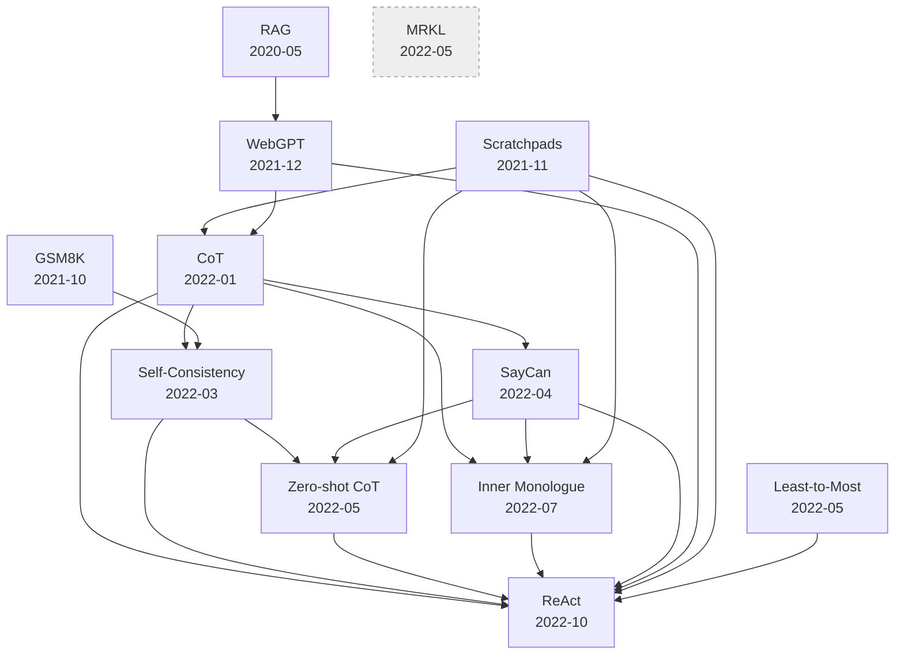

# 论文依赖图与阅读顺序

调研日期：2026-09-21。本文是 [`react-prehistory.md`](react-prehistory.md) 的**阅读指南**，不含内容结论——只回答「先读哪篇、每篇在依赖网的哪个位置、哪些我手里没有」。

## 0. 先说一个陷阱：版本日期与原始提交日期可能差一年

引用边是从**手上的 PDF 版本**的参考文献表里提的。同一个 arXiv 编号的不同版本，参考文献表不一样。

| 论文 | 原始提交 | 我手上的版本 | 差多久 | 后果 |
|---|---|---|---|---|
| CoT | 2022-01-28 (v1) | v6 2023-01-10 | **近一年** | 它引用了 2022-03 的 Self-Consistency 与 2022-04 的 SayCan——**v1 不可能引** |
| ReAct | 2022-10-06 (v1) | v3 2023-03-10 | 5 个月 | 引用面比 v1 宽 |
| Zero-shot CoT | 2022-05-21 (v1) | v4 2023-01-29 | 8 个月 | 引用了 2022-03 的 Self-Consistency |
| Self-Consistency | 2022-03-21 (v1) | v4 2023-03-07 | 近一年 | ICLR camera ready |
| WebGPT | 2021-12-17 (v1) | v3 2022-06-01 | 6 个月 | — |
| SayCan | 2022-04-04 (v1) | v2 2022-08-16 | 4 个月 | v2 追加了 PaLM 结果与 CoT 研究 |
| Inner Monologue | 2022-07-12 | v1（单版本） | — | 唯一没有这个问题的一篇 |

**怎么用这张表**：想判断「谁影响了谁」时，**用原始提交日期**（图的横轴）；引用边只说明**在我手上这个版本里**它们互相可见。CoT 引 SayCan 不代表 2022 年 1 月的 CoT 作者知道 SayCan，只代表 2023 年 1 月的修订版提到了它。

## 1. 依赖图

**先说明形式**：初版这里画的是一张 ASCII 折线图，但它有线条画了而表格没列的地方——ASCII 图的对齐靠手工数空格，改一次就可能骗人。所以改成两张表：**时间轴**告诉你每篇出现时能看见谁，**引用矩阵**给出每条边。要可视化的话文末有 Mermaid 片段，可以在 Git 预览里渲染。

### 1.1 时间轴（按原始提交日期）

| 提交 | 论文 | 它在这个时点能看见的、同一网络里的论文 |
|---|---|---|
| 2020-05-22 | RAG | — |
| 2021-10-27 | GSM8K | — |
| 2021-11-30 | Scratchpads | — |
| 2021-12-17 | WebGPT | RAG |
| 2022-01-28 | **CoT** | Scratchpads、WebGPT、GSM8K |
| 2022-03-21 | Self-Consistency | CoT、GSM8K |
| 2022-04-04 | SayCan | CoT |
| 2022-05-21 | Zero-shot CoT | CoT、Self-Consistency、Scratchpads、SayCan、GSM8K |
| 2022-05-21 | Least-to-Most | CoT |
| 2022-05-01 | MRKL | — |
| 2022-07-12 | Inner Monologue | CoT、Scratchpads、SayCan、GSM8K |
| 2022-10-07 | Self-Ask | CoT |
| 2022-10-06 | **ReAct** | 以上全部（它是唯一的集大成者） |
| 2022-11-18 | PAL | CoT |
| 2023-02-09 | Toolformer | CoT |

「能看见」一列对**摘要级**的那几篇是**推断**（我手里没有它们的参考文献表，只能按时间判断它们可能引谁），已在第 4 节标明。对七篇 PDF 级的是**已核实**。

### 1.2 引用矩阵（行 = 引用方，列 = 被引方）

只列**已核实**的边。`●` = 参考文献表里有明确条目。

| ↓引用 ／ 被引→ | RAG | GSM8K | Scratch | WebGPT | CoT | SC | SayCan | ZS-CoT | L2M | IM | Self-Ask |
|---|---|---|---|---|---|---|---|---|---|---|---|
| WebGPT | ● | | | | | | | | | | |
| CoT | | ● | ● | ● | | ●※ | ●※ | | | | |
| Self-Consistency | | ● | | | ● | | | ● | | | |
| SayCan | | | | | ● | | | | | | |
| Zero-shot CoT | | ● | ● | | ● | ● | ● | | | | |
| Inner Monologue | | ● | ● | | ● | | ● | | | | |
| ReAct | | ● | ● | ● | ● | ● | ● | ● | ● | ● | |

※ **CoT 行有两处只对 v6 成立**：Self-Consistency（2022-03）与 SayCan（2022-04）都晚于 CoT v1（2022-01），它们是 CoT 修订版加进去的。见第 0 节。

`SC` = Self-Consistency，`ZS-CoT` = Zero-shot CoT，`L2M` = Least-to-Most，`IM` = Inner Monologue。

**从矩阵能直接读出的三件事**：

1. **CoT 是被引最多的一篇**（五篇引它）——它是这个网络里的枢纽。
2. **ReAct 是唯一横跨全部列的**，除了 RAG。它没引 RAG，RAG 是通过 WebGPT 间接进来的。
3. **MRKL 是彻底的孤立节点**（零引用）；Least-to-Most 只被 ReAct 引用一次，其余六篇都没引它。

### 1.3 可渲染的 Mermaid 版本

Git 预览支持 Mermaid 的话，复制下面这段：

全部为实线，即每条边都在参考文献表里有条目。灰色孤立节点 = 在这七篇里零引用。

### 1.4 四条**不成立**的边（我一度误判，留在这里防你踩）

| 疑似 | 实情 |
|---|---|
| CoT 引用 Self-Ask | **无此引用**。CoT 全文没有 "self-ask" 或 Press——Self-Ask 晚它九个月 |
| SayCan 引用 Inner Monologue | **无此引用**。实为正文里 "through an inner monologue" 这个普通名词短语 |
| SayCan 引用 ReAct | **无此引用**。实为正文 "not easily able to **react** to situations" |
| CoT 引用 RAG | **无此引用**。CoT 参考文献表里没有 Lewis / Retrieval |

前三条的来源是**按作者姓氏做正则匹配**——`Huang`、`Nakano` 这类姓氏会撞上几百篇。这类匹配必须回原文看上下文，不能只看命中。

### 这张图没说的部分

- **非 ReAct 线内部的引用**（比如 Toolformer 引用 CoT）无法核实：那批论文我手里只有摘要，没有参考文献表。`react-lineage.md` 已经说过「Toolformer 2023-02 晚 ReAct 四个月」，方向可推，但**边没有证据**。
- **MRKL 与 Least-to-Most 在这七篇里一次都没被引用。** MRKL 是 AI21 的论文，不在 Google 那条线上；Least-to-Most 是 Google 的，但七篇里没人引它（ReAct 只在正文按名提到）。这两篇在依赖网里是**孤立节点**。

## 2. 阅读顺序

### 第一梯队：不读它们，后面的看不懂（3 篇）

| 顺序 | 论文 | 为什么在这个位置 |
|---|---|---|
| 1 | **CoT**（2201.11903） | 「让模型先写中间步骤」这个想法的**纯提示**版本，也是整张图的枢纽——七篇里有五篇引它。先读它，后面每篇都在跟它对话 |
| 2 | **ReAct**（2210.03629） | 你真正要研究的东西。放在第二而不是最后：它有完整的前置综述（Related Work 一节把要读的人名都点了），读完它你就知道剩下哪些值得读、哪些可以跳 |
| 3 | **Self-Consistency**（2203.11171） | 与 CoT 只差一个「采样 vs 贪心」，但它把「推理的可靠性」这件事摊开成可测的量。**读它才能理解为什么 agent 循环里没有多数投票** |

### 第二梯队：直接与 ReAct 的关系需要判断（3 篇）

| 顺序 | 论文 | 关键读点 |
|---|---|---|
| 4 | **Inner Monologue**（2207.05608） | ReAct 前言点名它是最接近的前作。**带着这个问题读**：ReAct 对它的概括（"limited to observations of the environment state"）对不对？IM 的 §3.3 第三类反馈与 §4.4 那一节是判断依据 |
| 5 | **SayCan**（2204.01691） | §3 的公式与 §5.2 的消融。它解决的是「模型说要做的，机器人做不到」——这个问题的形状和工具校验是同一个 |
| 6 | **WebGPT**（2112.09332） | §2 的环境设计与 Table 1 的动作表。**注意它的记忆模型**：每一步用全新 context，只留环境摘要 |

### 第三梯队：一条线索一段，可以跳读（3 篇）

| 顺序 | 论文 | 跳读建议 |
|---|---|---|
| 7 | **Zero-shot CoT**（2205.11916） | 只读 §3.1 两阶段机制 + Table 4（16 种触发句的消融，两页）。其余是各 benchmark 表格 |
| 8 | **RAG**（2005.11401） | 读 §2 的两种形式定义。它的主线（端到端训练检索器）与 agent 走的路相反，别当同一条线读 |
| 9 | **GSM8K**（2110.14168） | 只是数据集论文。读摘要够——CoT 与 Zero-shot CoT 的所有数字都跑在它上面，但方法部分与 agent 无关 |

## 3. 我手里没有的（8 篇，全是摘要级）

按「补上的价值」排序：

| 论文 | arXiv | 为什么值得补 |
|---|---|---|
| **Least-to-Most** | 2205.10625 | 与 Zero-shot CoT 同为「两次调用」，但目的不同（分解 vs 抽取）。两篇对照着读能看清「两次调用」这个设计空间 |
| **RAG** | 2005.11401 | 「检索由谁发起」那一节的另一半。手上只有摘要，RAG-Sequence / RAG-Token 的术语未核 |
| **Self-Ask** | 2210.03350 | 与 ReAct 同月、同任务、同目标，但用固定槽位触发检索。是理解「ReAct 为什么赢」的最直接对照组 |
| **PAL** | 2211.10435 | 「行动 = 执行代码」这条线。晚 ReAct 一个月 |
| **Toolformer** | 2302.04761 | 「工具使用进权重」这条线的代表，与 ReAct 的提示路线相反 |
| **MRKL** | 2205.00445 | 唯一从「系统架构」而非「提示技巧」出发的。今天 harness 的整体形状与它最接近 |
| **Scratchpads** | 2112.00114 | 中间步骤的最早形态，但它是训练式而非提示式。只需读「它与 CoT 差在哪」 |
| **GSM8K** | 2110.14168 | 只在第三梯队出现，摘要足够 |

下载命令见 [`../ref/README.md`](../ref/README.md)（`docs/ref/` 里的 PDF 不入 git，换机器要重下）。

## 4. 只有摘要的论文，引用边未知

这不是小事：**只读摘要无法判断一篇论文引了谁。** 上面那 8 篇里，凡是 2022 年之后的，它们与 CoT / ReAct 的引用关系目前**全靠推测**，不要在写作里当成已核实的事实引用。

要补的话，取 PDF 后按同样办法提参考文献表即可：`pdftotext -layout`，然后检索题名片段。**不要用作者姓氏做匹配**——见第 1 节那四条不成立的边。
